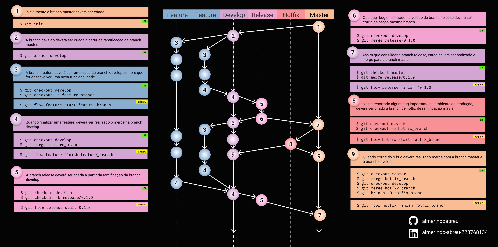

# gitflow

# 1 - GIT
# 1.2 - Instalaçao do Git
apt update && apt install git -y

# 1.3 - Configuração global nome
git config --global user.name "Fulano de Tal"

# 1.4 - Configuração global email
git config --global user.email fulano@gmail.com

# 1.5 - Iniciando o Git
git init

# 2 - Gitflow
# 2.2 - Iniciando o Git Flow
git flow init