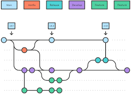

# gitflow

# 1 - GIT
# 1.2 - Instalaçao do Git
apt update && apt install git -y

# 1.3 - Configuração global nome
git config --global user.name "Fulano de Tal"

# 1.4 - Configuração global email
git config --global user.email fulano@gmail.com

# 1.5 - Iniciando o Git
git init

# 2 - Gitflow
# 2.2 - Iniciando o Git Flow
git flow init

# 3 - Gerando chave gpg
# 3.1 - Instalando gpg 
apt instal gpg

# 3.2 - Gerando Chave RSA and RSA default
gpg --full-generate-key

# 3.3 - verificando chave gerada
gpg --list-secret-key --keyid-form LONG

# 3.4 - Gerando o export da chave
gpg --armor --export chavegerada-sec-rsa4096/

# 3.5 - Salvando export
salvar na configuração do git em GPG keys

# 3.6 - Configurando o GIT para assinar o commit com GPG
git config --global user.signingkey chavegerada-sec-rsa4096/

# 3.7 - Habilitando TTY
colocar em ~/.bash_profile  
export GPG_TTY=$(tty)

